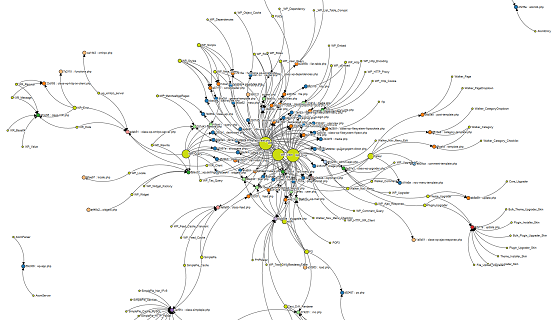

Description:
=======
This application tries to map all the classes in a source code directory and shows where they are used in one visual way.

Classes are represented by the color green and his size is proportional to the times than is used, the biggest ones are used more times.

All other colors represent php files that called one or more classes.

The graph generated by this code uses the javascript library d3

Output sample from the WordPress source code:
=======

Generic Example:
=======
http://localhost/index.php?dir=[PathToALocalDirectory]